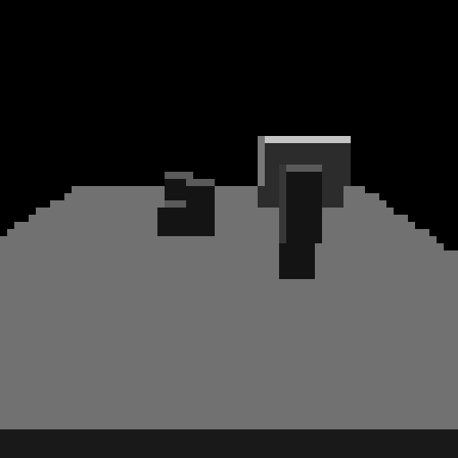

# Fixed-Point FPGA Voxel DDA Accelerator

[](https://github.com/quazimo1/voxel-ray-tracer/actions/workflows/ci.yml)

A simulation-complete prototype of a voxel traversal accelerator. It pairs a C++ 3D DDA golden model with a synthesizable SystemVerilog implementation and self-checking tests.

This repository validates the core accelerator, not an end-to-end Minecraft renderer. FPGA board deployment, host transport, and Minecraft/Iris integration are future work.

## What is implemented

- C++17 voxel grid and 3D DDA reference implementation
- C++ grid-entry handling for rays originating outside the grid
- Axis-aligned and arbitrary-direction rays
- PGM reference renderer
- Synthesizable fixed-point SystemVerilog traversal engine
- Request/valid voxel-memory interface
- Hit position, material, entry face, and distance outputs
- Self-checking C++ and RTL tests
- GitHub Actions testing and Yosys synthesis validation

## Architecture

```text
Ray source
    |
    v
Fixed-point DDA engine <----> voxel memory
    |
    v
hit/miss + voxel + material + face + distance
```

The RTL interface uses signed Q8.8 values by default:

| Signal | Format |
| --- | --- |
| Ray origin | signed Q8.8 |
| Ray direction | signed Q8.8 |
| Voxel address | signed integer |
| Hit distance | unsigned Q24.8 |

Directions do not need to be normalized. A direction such as `(4, 2, 1)` is valid; the reported distance is expressed in that ray parameterization.

The RTL expects origins inside the voxel volume. A host should clip external rays to the grid boundary before submission; the C++ model provides the required grid-entry behavior.

Face IDs are `0=-X`, `1=+X`, `2=-Y`, `3=+Y`, `4=-Z`, and `5=+Z`. Face `7` means the ray began inside an occupied voxel.

## Reference render



This 64×64 image is produced by the tested C++ reference renderer and enlarged with nearest-neighbor scaling for display.

## Run everything

Requirements: CMake, a C++17 compiler, Icarus Verilog, and optionally Yosys.

```bash
./scripts/test.sh
```

The script:

1. builds and tests the C++ model;
2. writes `software/dda_reference/rendered_output.pgm`;
3. compiles and runs the RTL testbench;
4. runs a Yosys synthesis check when Yosys is installed.

Run only the RTL simulation with:

```bash
./scripts/simulate.sh
```

## Repository layout

```text
hardware/rtl/                         DDA accelerator
hardware/tb/                          self-checking RTL testbench
hardware/syn/synth.ys                 technology-independent synthesis check
software/dda_reference/               C++ golden model, tests, and renderer
scripts/test.sh                       complete validation entry point
scripts/simulate.sh                   RTL-only validation
docs/PROJECT_STATUS.md                verified status and remaining work
```

## Scope boundary

The core traversal accelerator is complete at the simulation and generic-synthesis level. Claiming a working FPGA/Minecraft renderer would additionally require a selected board and transport, timing constraints, on-device validation, a host API, world-data extraction, and Iris shader integration. Those components are deliberately not represented as complete.

## License

MIT
